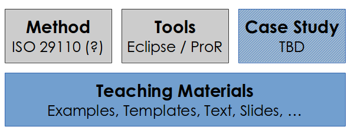

# Eclipse for Teaching Requirements and Systems Engineering

Requirements Management and Engineering (RE&M) is taught, both in industry and academia. The availability of open source RE-tools, and the RMF-based fmStudio in particular, created some interest for using those tools for teaching.

## Vision

Create (1) a set of teaching materials that is actively used; (2) which is embedded in a larger SE context; and (3) which explicitly focuses on applying RE.

## Scope

The scope is the creation of teaching materials, centered around a case study, based on existing methods and tools. This is visualized in the following picture: 

## Objectives

*    **Collaboration of Industry, Service Providers and Academia:** These three groups can benefit vastly from each other: Industry relies on academia for skilled labor, while service provider deliver expertise to industry in the form of knowledge (consultants) and tools (vendors).
*    **Standardization of basic RE (or SE) skills:** Preparation of students with a basic set of skills that is relevant in industry, so employers know what to expect.
*    **Teaching Materials:** Ideally, one outcome of this effort is a set of adaptable teaching materials. 

Initially, we will focus on teaching materials, specifically a case study. 

## Licensing

Contributed content will be licensed under the Apache License 2.0.
