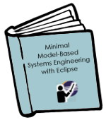

# Eclipse for Teaching Requirements and Systems Engineering

<a href="https://github.com/jastram/teaching/blob/master/SE/se-latex/main.pdf?raw=true">
-</a>
Requirements Management and Engineering (RE&M) is taught, both in industry and academia. The availability of open source RE-tools, and the RMF-based fmStudio in particular, created some interest for using those tools for teaching.  Download the book (right) to set up a **minimally complete, eclipse-based MDSE tool**.

## Vision

This project strives to disrupt the market for model-based system engineering (MBSE) tools. Today this market is dominated by a few large players, locking users into a proprietary ecosystem. By building an open tool platform, complete with a reference process and a case study, we provide a platform for experimentation that has the potential for commercial deployment.

The following picture visualizes what we are trying to achive:

We engage the main stakeholders (pink) and will produce content that provides easy access to MBSE (blue). And we build and maintain a community, held together by an online platform (green).
 
The three major **stakeholders** are (1) academia, (2) service providers and (3) industry users.  Industry wants methods and tools that work.  In the past, this was provided by tool vendors. By using open source tools, this could be provided by service providers instead, paid for by industry users, without vendor lock-in. Open Source tooling encourages engagement of academia, which uses it in teaching and research.

The content is freely licensed to encourage engagement, and consists of open source tooling, open documentation (which includes processes) and a case study.

## Watch the Video

Michael Jastram and Andrea Herrmann spoke [about this project at EclipseCon Europe 2014](https://www.eclipsecon.org/europe2014/session/eclipse-teaching-systems-engineering-35-minute-standard-talk). 

## Scope

The scope is the creation of teaching materials, centered around a case study, based on existing methods and tools. The elements are:

* **Method:** We use [ISO 29110](http://en.wikipedia.org/wiki/ISO_29110) as the foundation, which is a standard specifically for small organizations and teams.
* **Tools:** We use an Eclipse-based toolchain.  The first component (for requiremeents engineering) is [ProR](https://www.eclipse.org/rmf/).
* **Case Study:** The case study will be the development of an autonomous rover.
* **Teaching Materials:** The teaching materials will be collected in [this gitHub project](https://github.com/jastram/teaching), available under the Apache 2.0 License.

## Objectives

*    **Collaboration of Industry, Service Providers and Academia:** These three groups can benefit vastly from each other: Industry relies on academia for skilled labor, while service provider deliver expertise to industry in the form of knowledge (consultants) and tools (vendors).
*    **Standardization of basic RE (or SE) skills:** Preparation of students with a basic set of skills that is relevant in industry, so employers know what to expect.
*    **Teaching Materials:** Ideally, one outcome of this effort is a set of adaptable teaching materials. 

Initially, we will focus on teaching materials, specifically a case study. 

## Licensing

Contributed content will be licensed under the Apache License 2.0.
